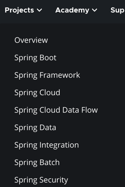
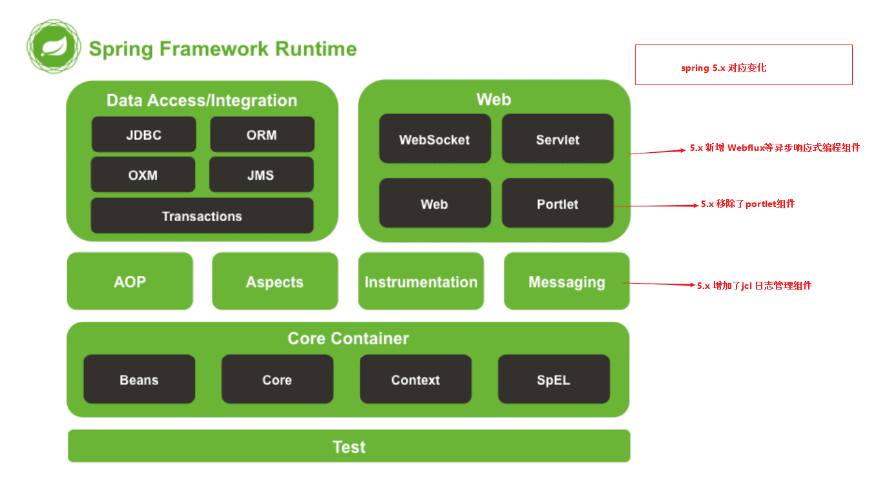
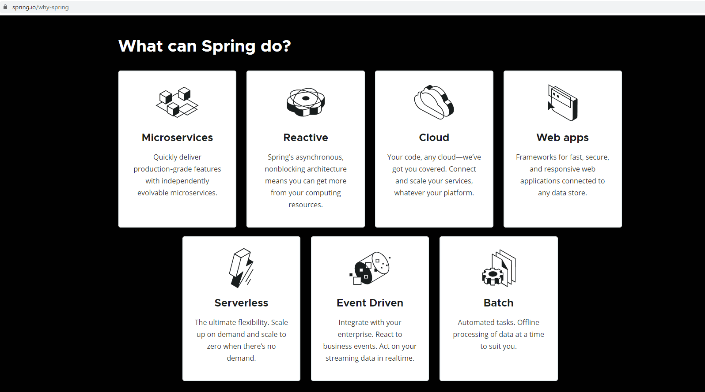

### 怎么诞生的？它的诞生是为了解决什么问题？

要谈Spring的历史，就要先谈J2EE。J2EE应用程序的广泛实现是在1999年和2000年开始的，
它的出现带来了诸如事务管理之类的核心中间层概念的标准化，但是在实践中并没有获得绝对的成功，因为开发效率，开发难度和实际的性能都令人失望。
曾经使用过EJB开发JAVA EE应用的人，一定知道，在EJB开始的学习和应用非常的艰苦，很多东西都不能一下子就很容易的理解。
EJB要严格地实现各种不同类型的接口，类似的或者重复的代码大量存在。而配置也是复杂和单调，同样使用JNDI进行对象查找的代码也是单调而枯燥。
虽然有一些开发工作随着xdoclet的出现，而有所缓解，但是学习EJB的高昂代价，和极低的开发效率，极高的资源消耗，都造成了EJB的使用困难。
而Spring出现的初衷就是为了解决类似的这些问题。</br>**Spring的一个最大的目的就是使JAVA EE开发更加容易。**</br>
同时，Spring之所以与Struts、Hibernate等单层框架不同，是因为Spring致力于提供一个以统一的、高效的方式构造整个应用，并且可以将单层框架以最佳的组合揉和在一起建立一个连贯的体系。
可以说Spring是一个提供了更完善开发环境的一个框架，可以为POJO(Plain Ordinary Java Object)对象提供企业级的服务。
Spring的形成，最初来自Rod Jahnson所著的一本很有影响力的书籍《Expert One-on-One J2EE Design and
Development》，就是在这本书中第一次出现了Spring的一些核心思想，该书出版于2002年。

### Spring 概览

[Spring官网](https://spring.io/)



Spring 家族中的主要分支：

1. Spring FrameWok：Spring 领域中其他一切的基础，提供了 核心容器和依赖注入框架，还提供了一些基本数据持久性支持，特别是基于模板的
   JDBC 文件。
2. Spring Boot：提供了 启动依赖、自动配置、Actuator监控等
3. Spring Data：将应用程序的数据存储库抽象为简单的 Java
   接口，同时当定义方法用于驱动数据进行存储和检索的问题时，对方法使用了命名约定。此外还能处理几种不同类型的数据库，包括包括关系型（JPA）、文档型（Mongo）、图型（Neo4j）等。
4. Spring Security：解决了广泛的应用程序安全性需求，包括身份验证、授权和 API 安全性等一系列工作。
5. Spring Integration 和 Spring Batch：解决了实时集成，即数据在可用时进行处理。相反，Spring Batch
   解决了批量集成的问题，允许在一段时间内收集数据，直到某个触发器（可能是一个时间触发器）发出信号，表示该处理一批数据。
6. Spring Cloud：Spring Cloud 是一组用 Spring 开发云本地应用程序的项目。

### Spring有哪些组件?



Spring 是一个分层架构，主要由如下 7 大模块所构成。Spring 模块位于核心容器，定义了创建、配置和管理 Bean 的方式。

* Spring Core：提供 Spring 框架基本功能，主要组件是 BeanFactory，是工厂模式的实现，通过 IOC 机制将应用程序的配置和依赖性规范与实际的应用程序代码分开。
* Spring Context：一个配置文件，给 Spring 框架提供上下文信息，上下文包括 JNDI、EJB、电子邮件、国际化、校验和调度等企业服务。
* Spring AOP ：通过配置管理特性，Spring AOP 直接将 AOP（面向切面）功能集成到 Spring 框架。从而我们能够十分方便的使用 Spring
  框架来管理任何支持 AOP 的对象。模块为基于 Spring 的应用程序中的对象提供了事务管理服务。通过使用该组件，可以不依赖其他组件九江声明性事务管理集成到应用程序中。
* Spring DAO：JDBC DAO 抽象层提供了有意义的异常层次结构，可以用来管理异常处理和不同数据库供应商抛出的错误信息。异常层次结构简化了错误处理，而且极大降低了需要编写的异常代码数量。Spring
  DAO 面向 JDBC 的异常遵从通用的 DAO 异常层次结构。
* Spring ORM：Spring 框架中插入了若干个 ORM 框架，从而提供了 ORM 的对象关系工具，其中包括 JDO、Hibernate 和 iBatis SQL
  Map，这些都遵从 Spring 的通用事务和 DAO 异常层次结构；
* Spring Web：Web 上下文模块建立在应用程序上下文模块之上，为基于 Web 的应用程序提供了上下文，所以 Spring 框架支持与 Jakarta
  Structs 的集成。同时该模块还简化了处理多部分请求以及请求参数绑定到域对象的工作。
* Spring Web MVC：MVC 是一个全功能的构建 Web 应用的 MVC 实现，可以通过策略接口对 MVC 框架实现高度可配置。而且 MVC 还容纳了
  JSP、Velocity、Tiles 等视图技术。

### Spring资料

[Spring Framework源码](https://github.com/spring-projects/spring-framework)

## 总结一下

### 什么是Spring?

> 为了解决我们开发者在 J2EE 开发时所遇到的众多问题，Rob Johnson 等人发起了 Spring 框架项目。
> Spring 是一个开源的 J2EE 应用程序框架，是针对 Bean 的生命周期进行管理的轻量级容器。
> 它既可以单独用于构建程序，也能和当前众多的 Web 框架进行组合使用，能够十分方便的降低当前企业应用开发的复杂性。

我们日常所说的 Spring，实际上指的是 Spring Framework，属于 Spring 家族的一个分支。

### 为什么用Spring?

> 官网说的挺好
> 
> 非常负责任的告诉你，最好最全的资料在Spring的官网!

* 方便解耦，简化开发过程；
* 支持面向切面编程（Aop），方便我们不用修改源码就能对功能进行增强；
* 整合支持 Junit，方便程序的测试；
* 既可以独立构建程序，也支持各种框架，而且大大降低各种框架使用难度；
* 支持事务管理，方便进行事物操作；
* 降低了各种 API 的开发难度；


### Spring框架如何应用？


### 设计需求分析

结合上面的使用场景，设计一个查询用户的案例的两个需求
- 查询用户数据
- 所有查询方法记录日志

### 那么Spring框架帮助我们做什么，它体现了什么哪些要点呢?

#### 控制反转 - IOC

> 来看第一个需求：查询用户（service通过调用dao查询pojo)，本质上如何创建User/Dao/Service等；

- 如果没有Spring框架，我们需要自己创建User/Dao/Service等，比如：

```
UserDaoImpl userDao = new UserDaoImpl();
UserSericeImpl userService = new UserServiceImpl();
userService.setUserDao(userDao);
List<User> userList = userService.findUserList();
```

- 有了Spring框架，可以将原有Bean的创建工作转给框架, 需要用时从Bean的容器中获取即可，这样便简化了开发工作

``` java
ApplicationContext context =
        new ClassPathXmlApplicationContext("services.xml");
UserServiceImpl service = context.getBean("userService", UserServiceImpl.class);
List<User> userList = service.findUserList();
```

1. Spring框架管理这些Bean的创建工作，即由用户管理Bean转变为框架管理Bean，这个就叫**控制反转 - Inversion of Control**;
2. Spring 框架托管创建的Bean放在哪里呢？ 这便是**IoC Container**;
3. Spring 框架为了更好让用户配置Bean，必然会引入**不同方式来配置Bean？ 这便是xml配置，Java配置，注解配置**等支持;
4. Spring框架既然接管了Bean的生成，必然需要**管理整个Bean的生命周期**等；
5. 应用程序代码从Ioc Container中获取依赖的Bean，注入到应用程序中，这个过程叫 **依赖注入(Dependency Injection，DI)**；
   所以说控制反转是通过依赖注入实现的，其实它们是同一个概念的不同角度描述。通俗来说就是**IoC是设计思想，DI是实现方式**
6. 在依赖注入时，有哪些方式呢？这就是构造器方式，@Autowired, @Resource, @Qualifier...
   同时Bean之间存在依赖（可能存在先后顺序问题，以及**循环依赖问题**等）`

#### 面向切面 - AOP

> 来看第二个需求：给Service所有方法调用添加日志（调用方法时)，本质上是解耦问题；

- 如果没有Spring框架，我们需要在每个service的方法中都添加记录日志的方法，比如：

```
public List<User> findUserList() {
    System.out.println("execute method findUserList");
    return this.userDao.findUserList();
}
```

- 有了Spring框架，通过@Aspect注解 定义了切面，这个切面中定义了拦截所有service中的方法，并记录日志；
  可以明显看到，框架将日志记录和业务需求的代码解耦了，不再是侵入式的了

```
@Around("execution(* com.kirin.springframework.service.*.*(..))")
public Object businessService(ProceedingJoinPoint pjp) throws Throwable {
    Method method = ((MethodSignature) pjp.getSignature()).getMethod();
    System.out.println("execute method: " + method.getName());
    return pjp.proceed();
}
```

1. Spring 框架通过定义切面, 通过拦截切点实现了不同业务模块的解耦，这个就叫面向切面编程 - Aspect Oriented Programming (
   AOP)
2. 为什么@Aspect注解使用的是aspectj的jar包呢？这就引出了Aspect4J和Spring AOP的历史渊源，只有理解了Aspect4J和Spring的渊源才能理解有些注解上的兼容设计
3. 如何支持更多拦截方式来实现解耦， 以满足更多场景需求呢？ 这就是@Around, @Pointcut... 等的设计
4. 那么Spring框架又是如何实现AOP的呢？ 这就引入代理技术，分静态代理和动态代理，动态代理又包含JDK代理和CGLIB代理等

### Spring框架设计如何逐步简化开发的

通过上述的框架介绍和例子，已经初步知道了Spring设计的两个大的要点：IOC和AOP；
从框架的设计角度而言，更为重要的是简化开发，比如提供更为便捷的配置Bean的方式，直至0配置（即约定大于配置）。

1. Java 配置方式改造
    - User，UserDaoImpl, UserServiceImpl，LogAspect不用改
    - 将原通过.xml配置转换为Java配置,在App中加载BeansConfig的配置
2. 注解配置方式改造
    - Java 5开始提供注解支持，Spring 2.5 开始完全支持基于注解的配置并且也支持JSR250 注解。在Spring后续的版本发展倾向于通过注解和Java配置结合使用.
    - BeanConfig 不再需要Java配置
    - UserDaoImpl 增加了 @Repository注解
    - UserServiceImpl 增加了@Service 注解，并通过@Autowired注入userDao.
    - 在App中扫描com.kirin.springframework包
3. SpringBoot托管配置
    - Springboot实际上通过约定大于配置的方式，使用xx-starter统一的对Bean进行默认初始化，用户只需要很少的配置就可以进行开发了。

