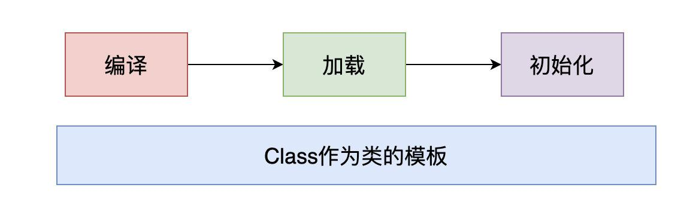

### 如何理解IoC

[Inversion of Control Containers and the Dependency Injection pattern](https://www.martinfowler.com/articles/injection.html)
IoC只是一种设计思想

首先想说说IoC（Inversion of
Control，控制反转）。这是spring的核心，贯穿始终。所谓IoC，对于spring框架来说，就是由spring来负责控制对象的生命周期和对象间的关系。这是什么意思呢，举个简单的例子，我们是如何找女朋友的？常见的情况是，我们到处去看哪里有长得漂亮身材又好的mm，然后打听她们的兴趣爱好、qq号、电话号、ip号、iq号………，想办法认识她们，投其所好送其所要，然后嘿嘿……这个过程是复杂深奥的，我们必须自己设计和面对每个环节。传统的程序开发也是如此，在一个对象中，如果要使用另外的对象，就必须得到它（自己new一个，或者从JNDI中查询一个），使用完之后还要将对象销毁（比如Connection等），对象始终会和其他的接口或类藕合起来。

那么IoC是如何做的呢？有点像通过婚介找女朋友，在我和女朋友之间引入了一个第三者：婚姻介绍所。婚介管理了很多男男女女的资料，我可以向婚介提出一个列表，告诉它我想找个什么样的女朋友，比如长得像李嘉欣，身材像林熙雷，唱歌像周杰伦，速度像卡洛斯，技术像齐达内之类的，然后婚介就会按照我们的要求，提供一个mm，我们只需要去和她谈恋爱、结婚就行了。简单明了，如果婚介给我们的人选不符合要求，我们就会抛出异常。整个过程不再由我自己控制，而是有婚介这样一个类似容器的机构来控制。Spring所倡导的开发方式就是如此，所有的类都会在spring容器中登记，告诉spring你是个什么东西，你需要什么东西，然后spring会在系统运行到适当的时候，把你要的东西主动给你，同时也把你交给其他需要你的东西。所有的类的创建、销毁都由
spring来控制，也就是说控制对象生存周期的不再是引用它的对象，而是spring。对于某个具体的对象而言，以前是它控制其他对象，现在是所有对象都被spring控制，所以这叫控制反转。

## 如何理解DI

IoC的一个重点是在系统运行中，动态的向某个对象提供它所需要的其他对象。这一点是通过DI（Dependency
Injection，依赖注入）来实现的。比如对象A需要操作数据库，以前我们总是要在A中自己编写代码来获得一个Connection对象，有了
spring我们就只需要告诉spring，A中需要一个Connection，至于这个Connection怎么构造，何时构造，A不需要知道。在系统运行时，spring会在适当的时候制造一个Connection，然后像打针一样，注射到A当中，这样就完成了对各个对象之间关系的控制。A需要依赖
Connection才能正常运行，而这个Connection是由spring注入到A中的，依赖注入的名字就这么来的。那么DI是如何实现的呢？Java
1.3之后一个重要特征是反射（reflection），它允许程序在运行的时候动态的生成对象、执行对象的方法、改变对象的属性，spring就是通过反射来实现注入的。

#### Spring Bean是什么

Spring里面的bean就类似是定义的一个组件，而这个组件的作用就是实现某个功能的，这里所定义的bean就相当于给了你一个更为简便的方法来调用这个组件去实现你要完成的功能。

#### IoC是什么

> 控制反转，不是什么技术，而是一种设计思想。在Java开发中，Ioc意味着将你设计好的对象交给容器控制，而不是传统的在你的对象内部直接控制。

1. **谁控制谁？**
   
   <br>传统Java SE程序设计，我们直接在对象内部通过new进行创建对象，是程序主动去创建依赖对象；而IoC是有专门一个容器来创建这些对象，即由Ioc容器来控制对象的创建；
   <br>谁控制谁？当然是IoC容器控制了对象；控制什么？那就是主要控制了外部资源获取（不只是对象包括比如文件等）。
2. **什么是反转？**
   
   <br>既然叫反转，肯定就有正转，正转其实就是对象去找实例，而反转就反过来了嘛，让实例来找对象；怎么找呢？当然是通过容器啦！
3. **谁依赖谁？**
   <br>对象无需自行创建或者管理它的依赖关系，依赖关系将被「自动注入」到需要它们的对象当中去<br>
   在spring项目中，将对象理解为Bean，也可以叫bean对象，这个bean和容器之间有个依赖关系，bean对象的创建是依赖容器的，就好像孩子依赖父母一样，孩子不能自己生出自己，需要父母的合作才能出生，这里的孩子就是bean，父母就是容器
4. **谁注入谁？**
   <br>通过容器注入了bean对象，而且这个过程是自动化的，也就是说容器会自动找到和bean对象匹配的类型实例注入到对象中

### IoC能做什么

不是一种技术，只是一种思想，一个重要的面向对象编程的法则，它能指导我们如何设计出松耦合、更优良的程序。传统应用程序都是由我们在类内部主动创建依赖对象，从而导致类与类之间高耦合，难于测试；有了IoC容器后，把创建和查找依赖对象的控制权交给了容器，由容器进行注入组合对象，所以对象与对象之间是
松散耦合，这样也方便测试，利于功能复用，更重要的是使得程序的整个体系结构变得非常灵活。

其实IoC对编程带来的最大改变不是从代码上，而是从思想上，发生了“主从换位”的变化。应用程序原本是老大，要获取什么资源都是主动出击，但是在IoC/DI思想中，应用程序就变成被动的了，被动的等待IoC容器来创建并注入它所需要的资源了。

#### IoC和DI是什么关系

> 控制反转是通过依赖注入实现的，其实它们是同一个概念的不同角度描述。通俗来说就是IoC是设计思想，DI是实现方式。
------

### Ioc 配置的三种方式

#### xml 配置

顾名思义，就是将bean的信息配置.xml文件里，通过Spring加载文件为我们创建bean。这种方式出现很多早前的SSM项目中，将第三方类库或者一些配置工具类都以这种方式进行配置，主要原因是由于第三方类不支持Spring注解。

- 优点： 可以使用于任何场景，结构清晰，通俗易懂
- 缺点： 配置繁琐，不易维护，枯燥无味，扩展性差

举例：

1. 配置xx.xml文件
2. 声明命名空间和配置bean

#### Java 配置

将类的创建交给我们配置的JavcConfig类来完成，Spring只负责维护和管理，采用纯Java创建方式。其本质上就是把在XML上的配置声明转移到Java配置类中

- 优点：适用于任何场景，配置方便，因为是纯Java代码，扩展性高，十分灵活
- 缺点：由于是采用Java类的方式，声明不明显，如果大量配置，可读性比较差

举例：

1. 创建一个配置类， 添加@Configuration注解声明为配置类
2. 创建方法，方法上加上@bean，该方法用于创建实例并返回，该实例创建后会交给spring管理，方法名建议与实例名相同（首字母小写）。注：实例类不需要加任何注解

#### 注解配置

通过在类上加注解的方式，来声明一个类交给Spring管理，Spring会自动扫描带有@Component，@Controller，@Service，@Repository这四个注解的类，然后帮我们创建并管理，前提是需要先配置Spring的注解扫描器。

- 优点：开发便捷，通俗易懂，方便维护。
- 缺点：具有局限性，对于一些第三方资源，无法添加注解。只能采用XML或JavaConfig的方式配置

举例：

1. 对类添加@Component相关的注解，比如@Controller，@Service，@Repository
2. 设置ComponentScan的basePackage, 比如<context:component-scan base-package='com.kirin.springframework'>
   或者@ComponentScan("com.kirin.springframework")注解，
   或者 new AnnotationConfigApplicationContext("com.kirin.springframework")指定扫描的basePackage.

------

### 依赖注入的三种方式

> 常用的注入方式主要有三种：构造方法注入（Construct注入），setter注入，基于注解的注入（接口注入）

#### 1.setter方式注入

在Spring3.x刚推出的时候，推荐使用注入的就是这种, 但是这种方式比较麻烦，所以在Spring4.x版本中推荐构造函数注入。

```xml

<bean id="userService" class="com.kirin.springframework.service.UserServiceImpl">
    <!-- setter注入方式 -->
    <property name="userDao" ref="userDao"/>
</bean>
```

写成Java代码,写起来不太方便，看起来也不整洁:

```java

@Controller
public class HelloController {
    private AlphaService alphaService;
    private BetaService betaService;

    @Autowired
    public void setAlphaService(AlphaService alphaService) {
        this.alphaService = alphaService;
    }

    @Autowired
    public void setBetaService(BetaService betaService) {
        this.betaService = betaService;
    }
}
```

#### 2.构造函数注入

在XML配置方式中，<constructor-arg>是通过构造函数参数注入，比如下面的xml:

```xml

<bean id="userService" class="com.kirin.springframework.service.UserServiceImpl">
    <!-- 构造函数注入 -->
    <constructor-arg name="userDao" ref="userDao"/>
</bean>
```

本质上是new UserServiceImpl(userDao)创建对象，所以对应的service类是这样的：

```java
public class UserServiceImpl {

    private final UserDaoImpl userDao;

    public UserServiceImpl(UserDaoImpl userDaoImpl) {
        this.userDao = userDaoImpl;
    }
}
```

在Spring4.x版本中推荐的注入方式就是这种：

```java

@Controller
public class HelloController {
    private final AlphaService alphaService;
    private final BetaService betaService;

    @Autowired
    public HelloController(AlphaService alphaService, BetaService betaService) {
        this.alphaService = alphaService;
        this.betaService = betaService;
    }
}
```

#### 3.Field注入

以@Autowired（自动注入）注解注入为例，修饰符有三个属性：Constructor，byType，byName。**默认按照byType注入**。

-

constructor：通过构造方法进行自动注入，spring会匹配与构造方法参数类型一致的bean进行注入，如果有一个多参数的构造方法，一个只有一个参数的构造方法，在容器中查找到多个匹配多参数构造方法的bean，那么spring会优先将bean注入到多参数的构造方法中。

- byName：被注入bean的id名必须与set方法后半截匹配，并且id名称的第一个单词首字母必须小写，这一点与手动set注入有点不同。
- byType：查找所有的set方法，将符合符合参数类型的bean注入。

比如：

```java

@Controller
public class HelloController {
    @Autowired
    private AlphaService alphaService;
    @Autowired
    private BetaService betaService;
}
```

------

### 为什么推荐构造器注入方式？

> The Spring team generally advocates constructor injection as it enables one to implement application components as
> immutable objects and to ensure that required dependencies are not null. Furthermore constructor-injected components
> are
> always returned to client (calling) code in a fully initialized state.

简单的翻译一下：这个构造器注入的方式能够保证注入的组件不可变，并且确保需要的依赖不为空。此外，构造器注入的依赖总是能够在返回客户端（组件）代码的时候保证完全初始化的状态。

- **依赖不可变**：其实说的就是final关键字。
- **依赖不为空**
  （省去了我们对其检查）：当要实例化UserServiceImpl的时候，由于自己实现了有参数的构造函数，所以不会调用默认构造函数，那么就需要Spring容器传入所需要的参数，所以就两种情况：1、有该类型的参数->
  传入，OK 。2：无该类型的参数->报错。
- **完全初始化的状态**
  ：这个可以跟上面的依赖不为空结合起来，向构造器传参之前，要确保注入的内容不为空，那么肯定要调用依赖组件的构造方法完成实例化。而在Java类加载实例化的过程中，构造方法是最后一步（之前如果有父类先初始化父类，然后自己的成员变量，最后才是构造方法），所以返回来的都是初始化之后的状态。

为啥不推荐setter注入:

```java

@Service
public class UserServiceImpl {

    private final UserDaoImpl userDao;

    public UserServiceImpl(final UserDaoImpl userDaoImpl) {
        this.userDao = userDaoImpl;
    }
}
```

如果使用setter注入，缺点显而易见，对于IOC容器以外的环境，除了使用反射来提供它需要的依赖之外，无法复用该实现类。而且将一直是个潜在的隐患，因为你不调用将一直无法发现NPE的存在。

```
UserServiceImpl userService = new UserServiceImpl();
// -> NullPointerException, 潜在的隐患
userService.findUserList();
```

循环依赖的问题：使用field注入可能会导致循环依赖，即A里面注入B，B里面又注入A：

```java
public class A {
    @Autowired
    private B b;
}

public class B {
    @Autowired
    private A a;
}
```

> 如果使用构造器注入，在spring项目启动的时候，就会抛出：BeanCurrentlyInCreationException：Requested bean is currently in
> creation: Is there an unresolvable circular reference？从而提醒你避免循环依赖，
> 如果是field注入的话，启动的时候不会报错，在使用那个bean的时候才会报错。

> 小结使用构造器注入的好处:
>- 保证依赖不可变（final关键字）
>- 保证依赖不为空（省去了我们对其检查）
>- 保证返回客户端（调用）的代码的时候是完全初始化的状态
>- 避免了循环依赖
>- 提升了代码的可复用性

### @Autowired和@Resource以及@Inject等注解注入有何区别？

> Field injection is not recommended (字段注入是不被推荐的)

-

依赖识别方式：@Autowired默认是byType,可以配合使用@Qualifier指定Name;@Resource默认ByName如果找不到则ByType;@Inject是默认按照类型匹配的,如果需要按名称进行装配，则需要配合@Named,没有required属性

- 适用对象：@Autowired、@Inject可以对构造器、方法、参数、字段使用，@Resource只能对方法、字段使用
- 提供方：@Autowired是Spring提供的，@Resource是JSR-250提供的,@Inject是JSR330规范实现的

Field注入的缺点:

- 不能像构造器那样注入不可变的对象
- 依赖对外部不可见，外界可以看到构造器和setter，但无法看到私有字段，自然无法了解所需依赖
- 会导致组件与IoC容器紧耦合（这是最重要的原因，离开了IoC容器去使用组件，在注入依赖时就会十分困难）
- 导致单元测试也必须使用IoC容器，原因同上
- 依赖过多时不够明显，比如我需要10个依赖，用构造器注入就会显得庞大，这时候应该考虑一下此组件是不是违反了单一职责原则

> 为什么IDEA只对@Autowired警告???
> <br>
> @Autowired是Spring提供的，它是特定IoC提供的特定注解，这就导致了应用与框架的强绑定，一旦换用了其他的IoC框架，是不能够支持注入的。
> <br>
> 而@Resource是JSR-250提供的，它是Java标准，我们使用的IoC容器应当去兼容它，这样即使更换容器，也可以正常工作。

代替方案：
<br>
如果不使用@Autowired，我们还可以使用JDK提供的@Resource注解，可减少与Spring的耦合，使用一样简单，所以一样会有容易滥用的问题。
<br>
更推荐的方式是使用构造注入。当需要越多依赖的时候，构造参数越多，看起来很丑陋，我们可以使用Lombok来简化构造器注入。
<br>
Lombok提供了三个相关的注解来简化依赖注入：

1. @AllArgsConstructor 用来生成包含所有字段构的造方法；
2. @NoArgsConstructor 用来生成无参的构造方法；
3. @RequiredArgsConstructor 生成的构造方法只包含声明为final或者non-null的字段。

### 总结

在平时的java应用开发中，我们要实现某一个功能或者说是完成某个业务逻辑时至少需要两个或以上的对象来协作完成，在没有使用Spring的时候，每个对象在需要使用他的合作对象时，自己均要使用像new
object()
这样的语法来将合作对象创建出来，这个合作对象是由自己主动创建出来的，创建合作对象的主动权在自己手上，自己需要哪个合作对象，就主动去创建，创建合作对象的主动权和创建时机是由自己把控的，而这样就会使得对象间的耦合度高了，A对象需要使用合作对象B来共同完成一件事，A要使用B，那么A就对B产生了依赖，也就是A和B之间存在一种耦合关系，并且是紧密耦合在一起，而使用了Spring之后就不一样了，创建合作对象B的工作是由Spring来做的，Spring创建好B对象，然后存储到一个容器里面，当A对象需要使用B对象时，Spring就从存放对象的那个容器里面取出A要使用的那个B对象，然后交给A对象使用，至于Spring是如何创建那个对象，以及什么时候创建好对象的，A对象不需要关心这些细节问题(
你是什么时候生的，怎么生出来的我可不关心，能帮我干活就行)，A得到Spring给我们的对象之后，两个人一起协作完成要完成的工作即可。

所以控制反转IoC(Inversion of Control)
是说创建对象的控制权进行转移，以前创建对象的主动权和创建时机是由自己把控的，而现在这种权力转移到第三方，比如转移交给了IoC容器，它就是一个专门用来创建对象的工厂，你要什么对象，它就给你什么对象，有了
IoC容器，依赖关系就变了，原先的依赖关系就没了，它们都依赖IoC容器了，通过IoC容器来建立它们之间的关系。

DI(依赖注入)其实就是IOC的另外一种说法，DI是由Martin Fowler 在2004年初的一篇论文中首次提出的。他总结：控制的什么被反转了？就是：获得依赖对象的方式反转了。


### Spring对Bean的生命周期管理
普通Java对象和Spring所管理的Bean实例化的过程是有些区别的:
在普通Java环境下创建对象简要的步骤可以分为：
- 1):java源码被编译为被编译为class文件
- 2):等到类需要被初始化时（比如说new、反射等）
- 3):class文件被虚拟机通过类加载器加载到JVM候选者：
- 4):初始化对象供我们使用候选者：简单来说，可以理解为它是用Class对象作为「模板」进而创建出具体的实例


------
而Spring所管理的Bean不同的是，除了Class对象之外，还会使用BeanDefinition的实例来描述对象的信息
比如说，我们可以在Spring所管理的Bean有一系列的描述：@Scope、@Lazy、@DependsOn等等,可以理解为：
Class只描述了类的信息，而BeanDefinition描述了对象的信息