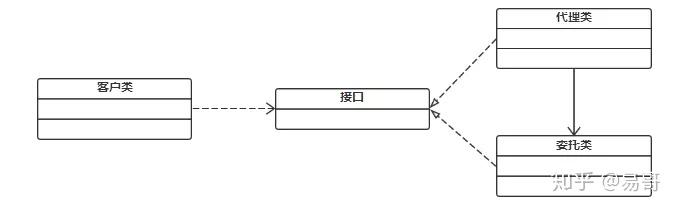
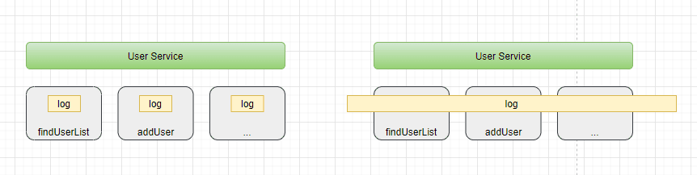
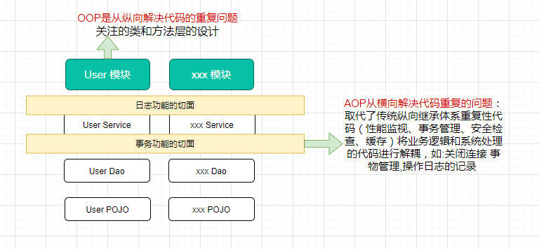

### 代理
代理就是帮人做事情。比如我们现在很常用的代购场景，我媳妇需要买一套护肤品，去官网买的话比较贵，所以就找代购去买，代购其实也没有这个护肤品，但是他有渠道直接跟护肤品的商家有关系，能直接从商家拿这个护肤品，你是没办法联系上这个商家的，但是他肯定不能一点酬劳都不收，所以他会加价卖给你，这就是代理的典型模式。

原本客户需要直接调用目标类（委托类），而现在客户需要通过代理类来调用目标类。


### 静态代理
代理类是自己手动创建的，所需要代理的目标类是确定的，实现简单容易理解


### 动态代理
代理模式的解释：为其他对象提供一种代理以控制对这个对象的访问，增强一个类中的某个方法，对程序进行扩展。
比如，现在存在一个UserService类：
```Java
public class UserService {

  public void test() {
    System.out.println("test...");
  }

}
```
此时，我们new一个UserService对象，然后执行test()方法，结果是显而易见的。
如果我们现在想在不修改UserService类的源码前提下，给test()增加额外逻辑，那么就可以使用动态代理机制来创建UserService对象了，比如：
```
UserService target = new UserService();

// 通过cglib技术
Enhancer enhancer = new Enhancer();
enhancer.setSuperclass(UserService.class);

// 定义额外逻辑，也就是代理逻辑
enhancer.setCallbacks(new Callback[]{new MethodInterceptor() {
	@Override
	public Object intercept(Object o, Method method, Object[] objects, MethodProxy methodProxy) throws Throwable {
		System.out.println("before...");
		Object result = methodProxy.invoke(target, objects);
		System.out.println("after...");
		return result;
	}
}});

// 动态代理所创建出来的UserService对象
UserService userService = (UserService) enhancer.create();

// 执行这个userService的test方法时，就会额外会执行一些其他逻辑
userService.test();
```
得到的都是UserService对象，但是执行test()方法时的效果却不一样了，这就是代理所带来的效果。

上面是通过cglib来实现的代理对象的创建，是基于父子类的，被代理类（UserService）是父类，代理类是子类，代理对象就是代理类的实例对象，代理类是由cglib创建的，对于程序员来说不用关心。

除开cglib技术，jdk本身也提供了一种创建代理对象的动态代理机制，但是它只能代理接口，也就是UserService得先有一个接口才能利用jdk动态代理机制来生成一个代理对象，比如：

```java

public interface UserInterface {
	public void test();
}

public class UserService implements UserInterface {

	public void test() {
		System.out.println("test...");
	}

}
```
利用JDK动态代理来生成一个代理对象：
```
UserService target = new UserService();

// UserInterface接口的代理对象
        Object proxy = Proxy.newProxyInstance(UserService.class.getClassLoader(), new Class[]{UserInterface.class}, new InvocationHandler() {
@Override
public Object invoke(Object proxy, Method method, Object[] args) throws Throwable {
        System.out.println("before...");
        Object result = method.invoke(target, args);
        System.out.println("after...");
        return result;
        }
        });

        UserInterface userService = (UserInterface) proxy;
        userService.test();
```
如果你把new Class[]{UserInterface.class}，替换成new Class[]{UserService.class}，允许代码会直接报错：
由于这个限制，所以产生的代理对象的类型是UserInterface，而不是UserService，这是需要注意的。


### AOP是什么?

AOP最早是AOP联盟的组织提出的,指定的一套规范,spring将AOP的思想引入框架之中,通过预编译方式和运行期间动态代理实现程序的统一维护的一种技术
> AOP的本质也是为了解耦，它是一种设计思想!!

举个例子,如何给如下UserServiceImpl中所有方法添加进入方法的日志：

```java
public class UserServiceImpl implements IUserService {

    @Override
    public List<User> findUserList() {
        System.out.println("execute method： findUserList");
        return Collections.singletonList(new User("pdai", 18));
    }

    @Override
    public void addUser() {
        System.out.println("execute method： addUser");
        // do something
    }
}
```

我们将记录日志功能解耦为日志切面，它的目标是解耦。进而引出AOP的理念：就是将分散在各个业务逻辑代码中相同的代码通过横向切割的方式抽取到一个独立的模块中！


OOP面向对象编程，针对业务处理过程的实体及其属性和行为进行抽象封装，以获得更加清晰高效的逻辑单元划分。而AOP则是针对业务处理过程中的切面进行提取，它所面对的是处理过程的某个步骤或阶段，以获得逻辑过程的中各部分之间低耦合的隔离效果。这两种设计思想在目标上有着本质的差异。

------

### AOP术语

- 连接点（Jointpoint）：表示需要在程序中插入横切关注点的扩展点，连接点可能是类初始化、方法执行、方法调用、字段调用或处理异常等等，Spring只支持方法执行连接点，在AOP中表示为在哪里干；
- 切入点（Pointcut）： 选择一组相关连接点的模式，即可以认为连接点的集合，Spring支持perl5正则表达式和AspectJ切入点模式，Spring默认使用AspectJ语法，在AOP中表示为在哪里干的集合；
- 通知（Advice）：在连接点上执行的行为，通知提供了在AOP中需要在切入点所选择的连接点处进行扩展现有行为的手段；包括前置通知（before
  advice）、后置通知(after advice)、环绕通知（around advice），在Spring中通过代理模式实现AOP，并通过拦截器模式以环绕连接点的拦截器链织入通知；在AOP中表示为干什么；
- 方面/切面（Aspect）：横切关注点的模块化，比如上边提到的日志组件。可以认为是通知、引入和切入点的组合；在Spring中可以使用Schema和@AspectJ方式进行组织实现；在AOP中表示为在哪干和干什么集合；
- 引入（inter-type declaration）：也称为内部类型声明，为已有的类添加额外新的字段或方法，Spring允许引入新的接口（必须对应一个实现）到所有被代理对象（目标对象）,
  在AOP中表示为干什么（引入什么）；
- 目标对象（Target Object）：需要被织入横切关注点的对象，即该对象是切入点选择的对象，需要被通知的对象，从而也可称为被通知对象；由于Spring
  AOP 通过代理模式实现，从而这个对象永远是被代理对象，在AOP中表示为对谁干；
- 织入（Weaving）：把切面连接到其它的应用程序类型或者对象上，并创建一个被通知的对象。这些可以在编译时（例如使用AspectJ编译器），类加载时和运行时完成。Spring和其他纯Java
  AOP框架一样，在运行时完成织入。在AOP中表示为怎么实现的；
- AOP代理（AOP
  Proxy）：AOP框架使用代理模式创建的对象，从而实现在连接点处插入通知（即应用切面），就是通过代理来对目标对象应用切面。在Spring中，AOP代理可以用JDK动态代理或CGLIB代理实现，而通过拦截器模型应用切面。在AOP中表示为怎么实现的一种典型方式；


> 通知类型：

1. 前置通知（Before advice）：在某连接点之前执行的通知，但这个通知不能阻止连接点之前的执行流程（除非它抛出一个异常）。
2. 后置通知（After returning advice）：在某连接点正常完成后执行的通知：例如，一个方法没有抛出任何异常，正常返回。
3. 异常通知（After throwing advice）：在方法抛出异常退出时执行的通知。
4. 最终通知（After (finally) advice）：当某连接点退出的时候执行的通知（不论是正常返回还是异常退出）。
5. 环绕通知（Around Advice）：包围一个连接点的通知，如方法调用。这是最强大的一种通知类型。环绕通知可以在方法调用前后完成自定义的行为。它也会选择是否继续执行连接点或直接返回它自己的返回值或抛出异常来结束执行。

环绕通知是最常用的通知类型。和AspectJ一样，Spring提供所有类型的通知，我们推荐你使用尽可能简单的通知类型来实现需要的功能。例如，如果你只是需要一个方法的返回值来更新缓存，最好使用后置通知而不是环绕通知，尽管环绕通知也能完成同样的事情。用最合适的通知类型可以使得编程模型变得简单，并且能够避免很多潜在的错误。比如，你不需要在JoinPoint上调用用于环绕通知的proceed()
方法，就不会有调用的问题。

### AOP的配置方式

#### XML Schema配置方式

#### AspectJ注解方式
